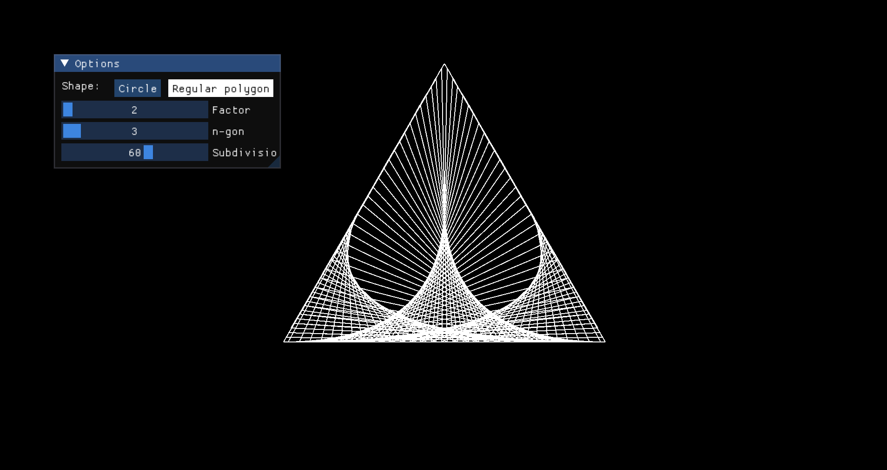
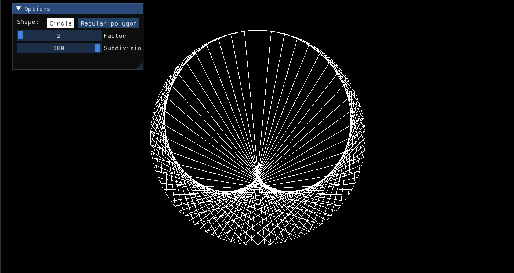
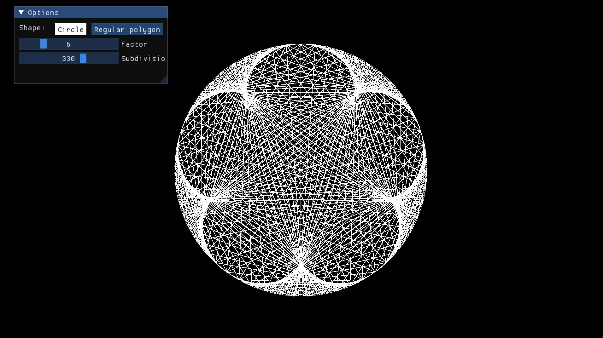
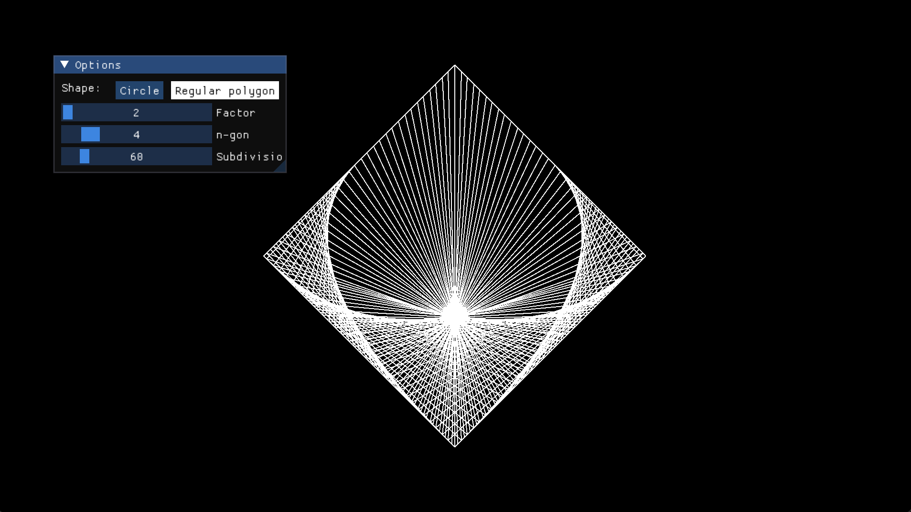
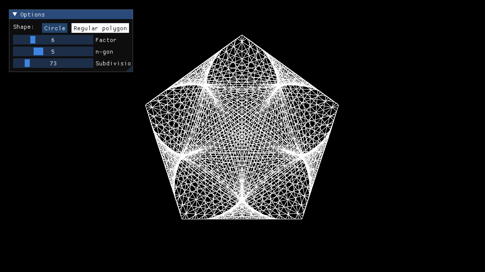
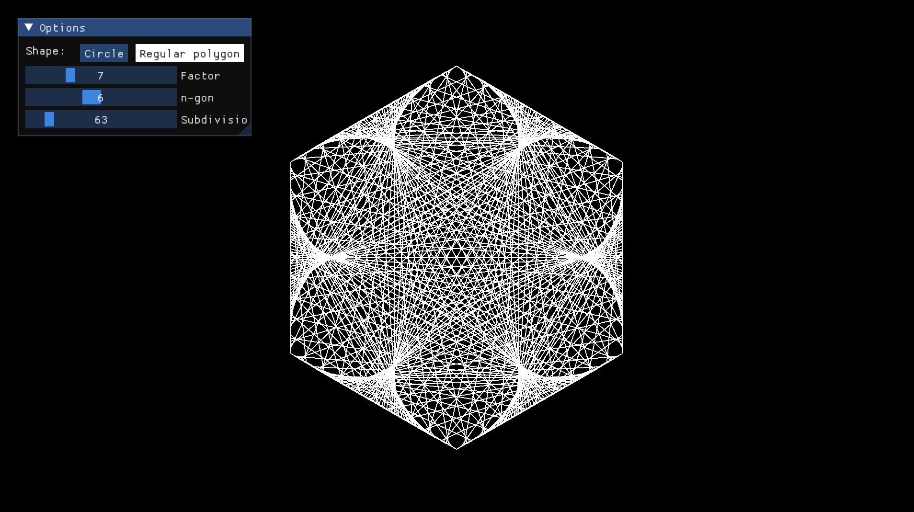
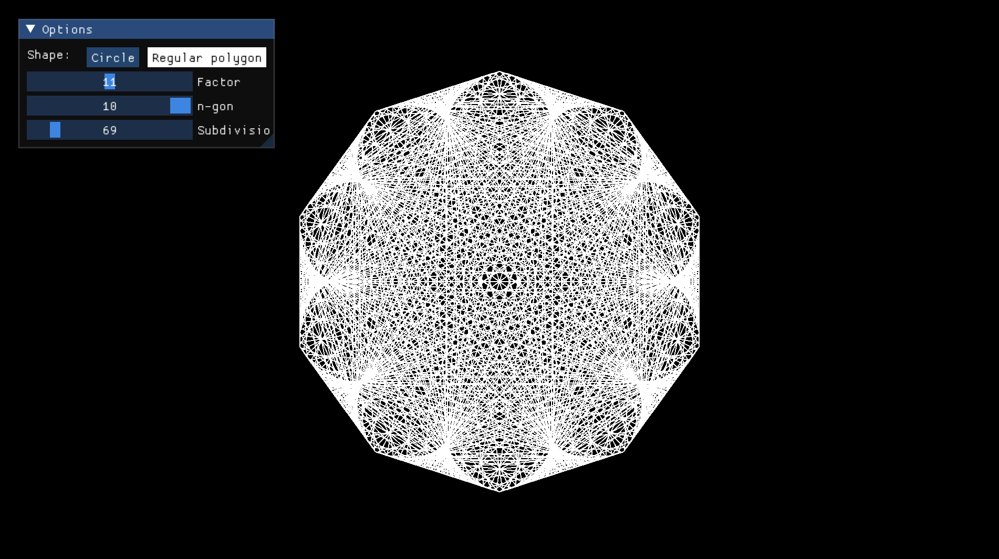

# TT

Time tables visualization in a variaty of shape. The idea came from watching a video of [Mathologer](https://youtu.be/qhbuKbxJsk8?si=hUTRNHKiVcMw5IQf)

## Installation

```sh
$ pip install git+https://github.com/ookiiwi/tt.git
$ tt # launch program
```

## Gallery
<p foat="left">
    </img>
    </img>
    </img>
    </img>
    </img>
    </img>
    </img>
</p>
